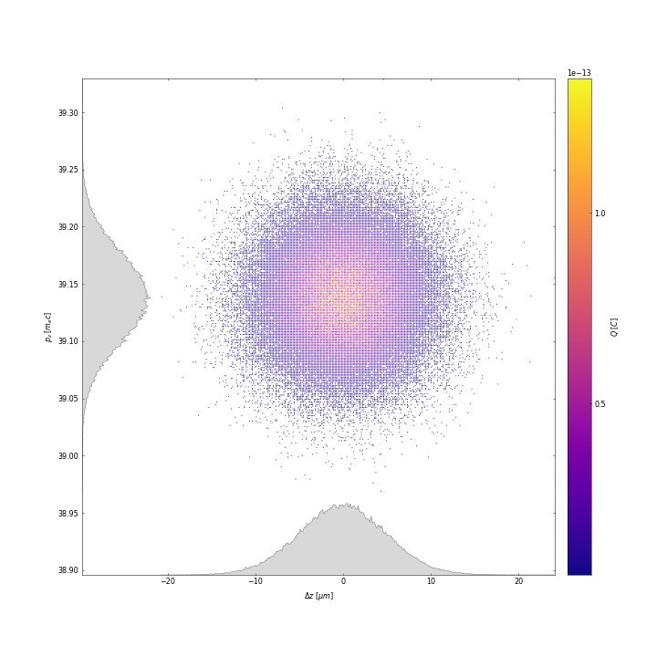
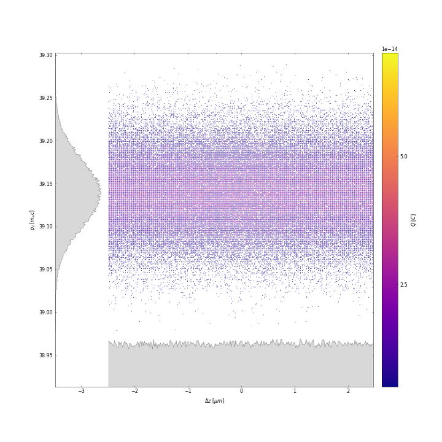
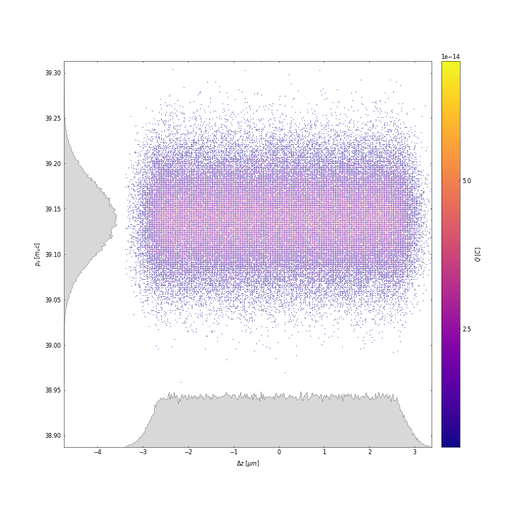
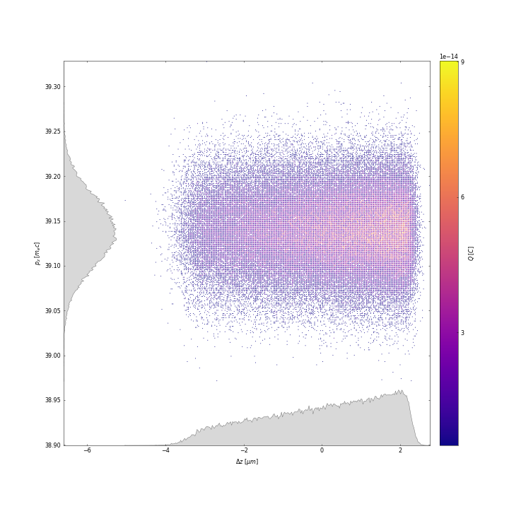
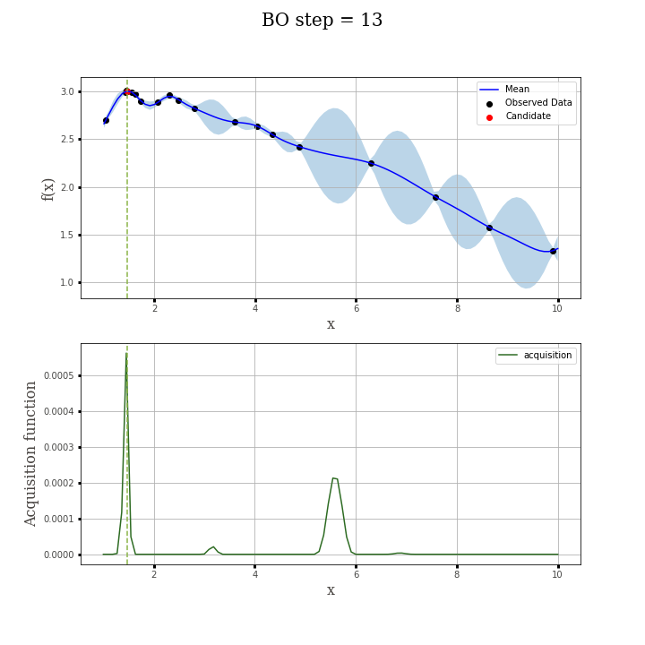
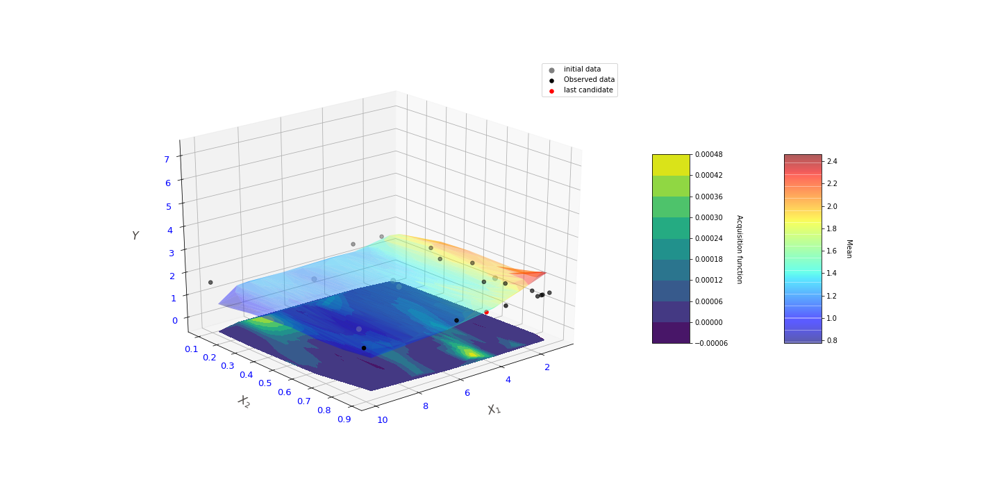

# Bayesian-Optimization-in-LPA
Application of Bayesian optimization to improve beam quality of laser plasma accelerators.

## Introduction to the problem

At the moment, traditional accelerators have their limits, and we need to find alternatives for them. Laser plasma accelerators (LPA) are very inter-
esting as a replacement for conventional accelerators, because of their small size and large accelerating fields. However producing high-quality beams
concerning industrial needs requires a meticulous balancing of a variety of physical effects and, as a result, is both conceptually and experimentally
hard. 

This work investigates how to optimize the source of electrons in the LPA for given requests from industry or academic institutions. Particularly,
the use of Bayesian Optimization on LPA parameters to achieve 150 MeV acceleration with a maximum energy conversion efficiency from the laser to the electron beam is studied.

The study can be divided into 4 main tasks:
- Task 1. Create appropriate objective functions and evaluation metric, and analyze and select the set of parameters to be optimized.
- Task 2. Investigate Bayesian Optimization with 1 parameter and compare results with optimum found by GridSearch
- Task 3. 2 parameters optimization
- Task 4. 9 parameters optimization

## Results

### Task 1

Three objective functions were used: absoulte error, energy conversion and artificial energy conversion. 
As evaluation metrics energy of the beam after acceleration and energy conversion were used.

During the study a new function has been created that changes the longitudinal profile of the beam. This function can be used in the future optimization study. Height of the trapezoid can be considered as a new parameter and increase dimension. 

  
  
  
  

   
   <em> Fig.1 Longitudinal profile of the electron beam</em>

Analysis of different parameters showed inefficiency of variation of only one parameter, since all of the laser and plasma and beam parameters are bounded with each other in non-linear way.

### Task 2

Main functions used to produce results in task 2 represented in the figure 2 are in the folder "Task 2/main_functions".Type of objectie function is a parameter that has to be chosen by user.

  

   
   <em> Fig.2 Bayesian Optimization process: 1 parameter</em>

### Task 3

Main functions used to produce results in task 3 represented in the figure 3 are in the folder "Task 3/main_functions".Type of objectie function is a parameter that has to be chosen by user.

  

   
   <em> Fig.3 Bayesian Optimization process: 2 parameter</em>

### Task 4

For the task 4 private library "libe_opt" was used and can not be reproduced by users. However results of the optimization of 9 parameters and main simulation analysis are showen in main notebooks in the folder Task 4.

